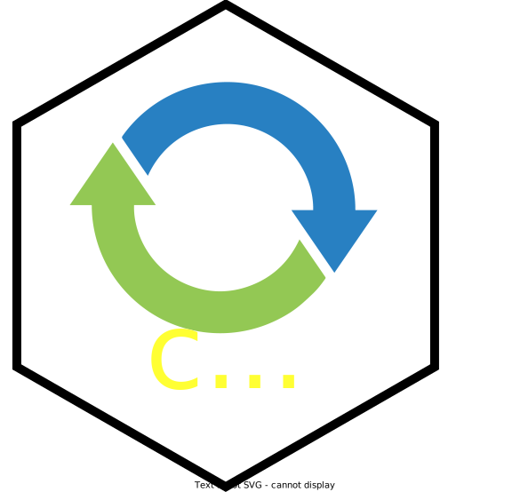

<!-- README.md is generated from README.Rmd. Please edit that file -->

# cccapi 

<!-- badges: start -->

[](https://github.com/RaoulWolf/cccapi/actions)
[](https://app.codecov.io/gh/RaoulWolf/cccapi?branch=master)
[](https://lifecycle.r-lib.org/articles/stages.html#experimental)
<!-- badges: end -->

> A [ZeroPM](https://zeropm.eu/) R package

The goal of the cccapi package is to provide a minimal and lightweight
interface to the [CAS Common
Chemistry](https://commonchemistry.cas.org/) API services. To get access
to the API services, you need to register at
<https://www.cas.org/services/commonchemistry-api>.

The dependencies of cccapi are kept at a bare minimum:
[curl](https://cran.r-project.org/web/packages/curl/index.html) for
handling the API requests and
[jsonlite](https://cran.r-project.org/web/packages/jsonlite/index.html)
to parse data from JSON format.

## Installation

You can install the development version of cccapi from
[GitHub](https://github.com/) with:

``` r
# install.packages("devtools")
remotes::install_github("ZeroPM-H2020/cccapi")
```

## Examples

The following examples show the functionality of the three API functions
of cccapi: `get_detail()`, `get_export()`, and `get_search()`.

This is an example which shows you how to get the record details for a
CAS Registry Number. In this case, for aspirin:

``` r
library(cccapi)
cas_rn <- "50-78-2"
get_detail(cas_rn)
```

Here is an example which shows you how to get the MOL file for a CAS
Registry Number. In this case, again, for aspirin:

``` r
library(cccapi)
cas_rn <- "50-78-2"
get_export(cas_rn)
```

And finally, here is an example which shows you how to search for CAS
Registry Numbers with a partial name. See `?get_search` for details on
the available search options!

``` r
library(cccapi)
q <- "Aspiri*"
get_search(q)
```

## Acknowledgement

This R package was developed by the EnviData initiative at the
[Norwegian Geotechnical Institute (NGI)](https://www.ngi.no/eng) as part
of the project [ZeroPM: Zero pollution of Persistent, Mobile
substances](https://zeropm.eu/). This project has received funding from
the European Union’s Horizon 2020 research and innovation programme
under grant agreement No 101036756.

------------------------------------------------------------------------

If you find this package useful and can afford it, please consider
making a donation to a humanitarian non-profit organization, such as
[Sea-Watch](https://sea-watch.org/en/). Thank you.
